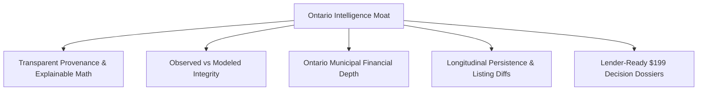

# Strategic Competitive Positioning & Differentiation Matrix

**Product:** Ontario Economic & Business Intelligence Platform  
**Document Classification:** Strategy & Commercial Positioning (Phase 2 Amendment #7)  
**Last Updated:** September 2026  

---

## 1. Competitive Landscape & Market Realities

We explicitly acknowledge and track established Canadian and North American location-intelligence platforms as direct and indirect competitors:

1. **Environics Analytics (Bell Canada):** PRIZM segmentation, DemoStats, WealthScapes. High annual enterprise contract values ($25k–$100k+/year), opaque statistical modeling, multi-month sales cycles, inaccessible to independent franchisees and small business buyers.
2. **Placer.ai:** Mobile foot-traffic and geofencing. Proprietary device panels, calibration requirements, privacy compliance complexity, and prohibitive entry pricing for self-service users.
3. **CoStar / LoopNet:** Commercial real estate focus, broker listings, subscription lock-in. Minimal municipal financial intelligence or localized retail gap analytics.
4. **Statistics Canada (StatCan) Portal & CANSIM:** High raw data authority, but completely fragmented across thousands of tables, non-visual, unjoined, lacking localized competitive context or franchise feasibility modeling.

We do **not** claim to be "second to none" or universally superior across all enterprise GIS dimensions. Instead, our competitive advantage is laser-focused on specific structural moats that enterprise incumbents cannot or will not offer.

---

## 2. Core Pillars of Differentiation

### 1. Transparent Source Provenance
- Every metric, chart, and KPI displays its exact upstream catalogue lineage (e.g. Statistics Canada Table `98-401-X2021001`, Table `33-10-1097-01`, MMAH FIR Schedule 10/40).
- Zero black-box indices. The formula for every gap score, z-score, and percentile is published and inspectable by lenders, accountants, and municipal planners.

### 2. Strict Observed vs. Modeled Distinction
- Clear visual badges and schema enforcement distinguish between legally verified records (such as mandatory quinquennial census returns and official property transfers) versus modeled estimates (such as expenditure surveys at CMA levels).
- Asking prices and confirmed transaction prices are kept strictly separate to prevent appraisal bias.

### 3. Ontario-Specific Municipal Depth & Financial Intelligence
- Deep ingestion of Ontario Ministry of Municipal Affairs and Housing (MMAH) Financial Information Returns (FIR) for all municipalities.
- Analyzes municipal infrastructure spending, property tax composition, capital investment reserves, and debt servicing ratios alongside retail market demographics.

### 4. Longitudinal Persistence as a Defensible Moat
- We never overwrite temporal observations. As municipal budgets, census releases, commercial rents, and business listings evolve over time, we accumulate historical snapshots and calculate automated diffs.
- This creates an irreversible data moat that strengthens with each quarterly and annual cycle.

### 5. Accessible Self-Service Pricing & Decision Dossiers
- Instead of requiring a $25,000 annual corporate commitment, independent entrepreneurs, prospective franchisees, and commercial brokers can access the intelligence platform directly and purchase on-demand **$199 CAD Location Feasibility Dossiers**.
- Lender-ready documentation designed specifically to support **Canada Small Business Financing Program (CSBFP)** bank loan applications and institutional lease negotiations.

---

## 3. Competitive Comparison Matrix

| Feature / Capability | Enterprise GIS & Telco Panels (Environics / Placer) | Commercial Broker Tools (CoStar) | StatCan Raw Portal | **Ontario Economic Intelligence** |
| :--- | :---: | :---: | :---: | :---: |
| **Pricing Model** | $25k–$100k+/year enterprise contract | $5k–$20k/year seat licenses | Free public portal | **Accessible Self-Service + $199 Feasibility Dossier** |
| **Target Audience** | Tier-1 Retail Chains, Banks, Telcos | Commercial Brokers & Landlords | Academic researchers, GIS analysts | **Entrepreneurs, Franchisees, Brokers, EDOs, Lenders** |
| **Source Provenance** | Proprietary synthetic panel | Broker submission / Listings | Direct public data | **100% Audited & Attributed (StatCan, MMAH, OpenData)** |
| **Math Transparency** | Opaque black-box models | Private listing comps | Raw data (no business models) | **100% Explainable Formulas & Published Code** |
| **Municipal Finances** | Not supported | Not supported | Fragmented provincial files | **Integrated MMAH FIR Multi-Year Revenue/Expense** |
| **Ontario Municipal Coverage** | Focus on Top 20 CMAs | Focus on major urban markets | 444 CSDs (unlinked) | **All 444 Ontario Municipalities Explicitly Modeled** |
| **Longitudinal Event Diffs** | Proprietary daily trends | Historical listing states | Annual releases (no diff alerts) | **Automated diff alerts on prices, relists & budgets** |
| **Banker/CSBFP Feasibility Dossier** | Requires bespoke consulting ($$$) | CRE listing tear-sheet | None | **1-Click 12-Page Lender-Ready PDF Dossier** |

---

## 4. Multi-Channel Commercial Validation Strategy (Amendment #8)

Willingness to pay for the **$199 Location Feasibility Dossier** will not rely solely on a single ad keyword. Multi-channel discovery and customer acquisition includes:

1. **Commercial Property & Lease Intent:** Entrepreneurs searching for retail space, plaza leases, and commercial zoning in Ontario.
2. **Franchise & Startup Inquiries:** Active franchise buyers evaluating territory availability and demographic thresholds (e.g. QSR, fitness, daycare).
3. **Direct Outreach to Commercial Real Estate Brokers:** Offering white-labeled feasibility summaries to accelerate client lease signings.
4. **Business-For-Sale Evaluators:** Prospective buyers reviewing listings on business marketplaces who need objective municipal validation.
5. **Burlington Benchmark Showcase:** A complete, unredacted, authoritative sample dossier for Burlington, Ontario, serving as the benchmark gold standard to validate purchase intent before checkout.
